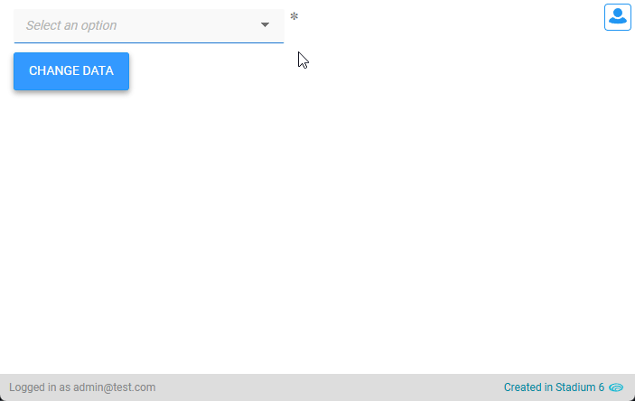

# DropDown Filter

When dropdowns contain many items, finding an item can be cumbersome and frustrating. Here is a simple example of how to add a filter to a dropdown. 



# Version 
Current version 1.4

1.1 Added logic to detect uniqueness of DropDown classname on page

1.2 Fixed RequiredFieldValidator bug (JS & CSS)

1.3 Fixed "controls in template" bug

1.4 Switched from Dom to DataModel; added version to CSS files

1.4.1 Replaced px with rem; updated readme to 6.12+

1.5 Adding code to allow the script to be called multiple times on the same page

## Application Setup
1. Check the *Enable Style Sheet* checkbox in the application properties

## Global Script Setup
1. Create a Global Script called "FilterDropdown"
2. Add three input parameters to the Global Script
   1. CaseSensitive
   2. DropDownClassName
   3. StartsWith
3. Drag a JavaScript action into the script
4. Add the Javascript below unchanged into the JavaScript code property
```javascript
/* Stadium Script version 1.5 https://github.com/stadium-software/dropdown-filter */
let scope = this;
let classInput = ~.Parameters.Input.DropDownClassName;
if (typeof classInput == "undefined") {
    console.error("The DropDownClassName parameter is required");
    return false;
} 
let className = "." + classInput;
let ddContainer = document.querySelectorAll(className);
if (ddContainer.length == 0) {
    console.error("The class '" + className + "' is not assigned toany DropDown");
    return false;
} else if (ddContainer.length > 1) {
    console.error("The class '" + className + "' is assigned to multiple DropDowns. Every filterable DropDown must have a unique classname");
    return false;
} else { 
    ddContainer = ddContainer[0];
}
const dd = ddContainer.querySelector("select");
const parent = dd.parentElement;

const caseSensitive = ~.Parameters.Input.CaseSensitive;
const startsWith = ~.Parameters.Input.StartsWith;

let container = parent.querySelector(".dropdown-filter-container");
if (container) {
    container.remove();
}

container = document.createElement("div");
container.classList.add("dropdown-filter-container");
parent.appendChild(container);

const ev = new Event("change");
dd.addEventListener("change", () => { }, false);

let input = document.createElement("input");
input.classList.add("form-control");
input.setAttribute("placeholder", "Filter");
container.appendChild(input);

let observerOptions = {
    characterData: true,
    childList: true,
    subtree: true,
},
observer = new MutationObserver(populateFilterOptions);
let selectOption = (e) => {
    dd.value = e.target.getAttribute("value");
    let hintOption = dd.querySelector(".option-hint");
    if (hintOption) dd.querySelector(".option-hint").classList.add("hide");
    dd.classList.remove("select-option-hint");
    container.classList.remove("show");
    resetDropDown();
    dd.dispatchEvent(ev);
};
let getObjectName = (obj) => {
    let objname = obj.id.replace("-container","");
    do {
        let arrNameParts = objname.split(/_(.*)/s);
        objname = arrNameParts[1];
    } while ((objname.match(/_/g) || []).length > 0 && !scope[`${objname}Classes`]);
    return objname;
};
function getDMValues(ob, property) {
    let obname = getObjectName(ob);
    return scope[`${obname}${property}`];
}
function populateFilterOptions() {
    observer.disconnect();
    let optionsDiv = ddContainer.querySelector(".dropdown-filter-options-container");
    if (optionsDiv) {
        optionsDiv.remove();
    }

    let optionsContainer = document.createElement("div");
    optionsContainer.classList.add("dropdown-filter-options-container");

    let options = getDMValues(ddContainer, "Options");
    for (let i = 0; i < options.length; i++) {
        let option = document.createElement("div");
        option.classList.add("dropdown-filter-option");
        option.setAttribute("value", options[i].value);
        option.textContent = options[i].text;
        option.addEventListener("click", selectOption);
        optionsContainer.appendChild(option);
    }
    container.appendChild(optionsContainer);
    observer.observe(dd, observerOptions);
}
function resetDropDown() {
    let filterOptions = ddContainer.querySelectorAll(".dropdown-filter-option");
    for (let i = 0; i < filterOptions.length; i++) {
        filterOptions[i].classList.remove("hide");
    }
    input.value = "";
}

populateFilterOptions();
input.addEventListener("input", function () {
    let filterOptions = ddContainer.querySelectorAll(".dropdown-filter-option");
    for (let i = 0; i < filterOptions.length; i++) {
        let needle = input.value;
        let heystack = filterOptions[i].innerHTML;
        if (!caseSensitive) { 
            needle = needle.toLowerCase();
            heystack = heystack.toLowerCase();
        }
        if (startsWith && heystack.indexOf(needle) == 0) {
            filterOptions[i].classList.remove("hide");
        } else if (!startsWith && heystack.indexOf(needle) > -1) {
            filterOptions[i].classList.remove("hide");
        } else {
            filterOptions[i].classList.add("hide");
        }
    }
});
input.addEventListener("blur", function () {
    if (input.value == "") {
        resetDropDown();
    }
});
dd.addEventListener("mousedown", function (e) {
    e.preventDefault();
    container.classList.toggle("show");
    input.focus();
});
document.body.addEventListener("click", function (e) {
    if (!e.target.closest(className)) {
        container.classList.remove("show");
        resetDropDown();
    }
});
```

## DropDown Setup
1. Drag a DropDown Control to the page
2. Add a unique classname of your choice to the DropDown classes property (e.g. my-dropdown-filter)
3. Populate the DropDown with data
4. Note: If multiple filterable dropdowns are shown on one page, each DropDown must have a unique classname

## Page.Load Event Setup
1. Drag the "FilterDropdown" script into the Page.Load event
2. Enter the classname of the FilterDropdown into the *DropDownClassName* input parameter (e.g. my-dropdown-filter)
3. By default string comparisons are not case sensitive. If you want the filter to be case sensitive, add *true* into the *CaseSensitive* input parameter
4. By default the filter matches strings using *Contains*. To change this to *StartsWith*, enter *true* into the *StartsWith* input parameter

## DropDown Data Update
The script only needs to be called once to initialise the *DropDown* control as a filterable dropdown. Just use a *SetValue* to assign a new dataset to the *DropDown* control to update the *DropDown* options. 

## CSS
The CSS below is required for the correct functioning of the module. Variables exposed in the [*filter-dropdown-variables.css*](filter-dropdown-variables.css) file can be [customised](#customising-css).

### Before v6.12
1. Create a folder called "CSS" inside of your Embedded Files in your application
2. Drag the two CSS files from this repo [*filter-dropdown-variables.css*](filter-dropdown-variables.css) and [*filter-dropdown.css*](filter-dropdown.css) into that folder
3. Paste the link tags below into the *head* property of your application
```html
<link rel="stylesheet" href="{EmbeddedFiles}/CSS/filter-dropdown.css">
<link rel="stylesheet" href="{EmbeddedFiles}/CSS/filter-dropdown-variables.css">
``` 

### v6.12+
1. Create a folder called "CSS" inside of your Embedded Files in your application
2. Drag the CSS files from this repo [*filter-dropdown.css*](filter-dropdown.css) into that folder
3. Paste the link tag below into the *head* property of your application
```html
<link rel="stylesheet" href="{EmbeddedFiles}/CSS/filter-dropdown.css">
``` 

### Customising CSS
1. Open the CSS file called [*filter-dropdown-variables.css*](filter-dropdown-variables.css) from this repo
2. Adjust the variables in the *:root* element as you see fit
3. Stadium 6.12+ users can comment out any variable they do **not** want to customise
4. Add the [*filter-dropdown-variables.css*](filter-dropdown-variables.css) to the "CSS" folder in the EmbeddedFiles (overwrite)
5. Paste the link tag below into the *head* property of your application (if you don't already have it there)
```html
<link rel="stylesheet" href="{EmbeddedFiles}/CSS/filter-dropdown-variables.css">
``` 
6. Add the file to the "CSS" inside of your Embedded Files in your application

**NOTE: Do not change any of the CSS in the 'filter-dropdown.css' file**

## Upgrading Stadium Repos
Stadium Repos are not static. They change as additional features are added and bugs are fixed. Using the right method to work with Stadium Repos allows for upgrading them in a controlled manner. 

How to use and update application repos is described here: [Working with Stadium Repos](https://github.com/stadium-software/samples-upgrading)